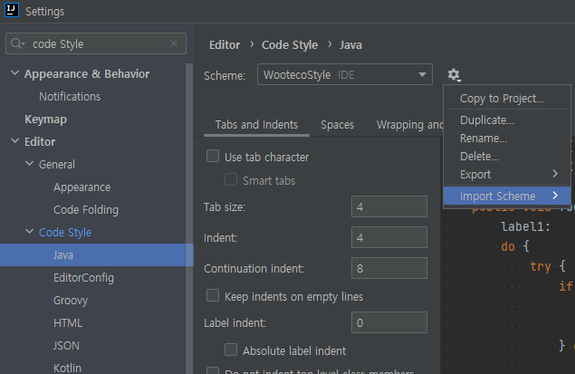
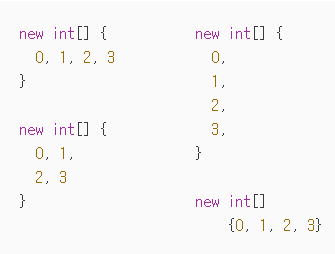

# 기능목록

### 기능목록 트래킹
A-1 ~ F-2


#### 게임시작(A)
- [ ] 게임시작문구 출력(A-1)

#### 컴퓨터 임의의 수 생성(B)
- [ ] 컴퓨터가 1~9까지의 서로다른 임의의 수 3개를 선택(B-1)
    - amp.nextstep.edu.missionutils.Randoms의 pickNumberInRange()사용
    - [ ] 숫자가 요구사항 만족하도록 유효성 검사(B-1-1)


#### 사용자로부터 입력받기(C)
- camp.nextstep.edu.missionutils.Console의 readLine() 을 사용
- [ ] "숫자를 입력해주세요 : "출력(C-1)
- [ ] 사용자로부터 3자리 숫자입력받음(C-2)
- [ ] 숫자가 요구사항 만족하도록 유효성 검사(C-3)
- [ ] 사용자가 잘못된 값을 입력할 경우 IllegalArgumentException을 발생시킨 후 애플리케이션은 종료(C-4)

#### 결과출력(D)
- [ ] 컴퓨터는 사용자로 부터 입력받은 3개의 숫자로부터 결과출력(D-1)
    - [ ] 같은수가 같은자리 :스트라이크(D-1-1)
    - [ ] 같은수가 다른자리 :볼(D-1-2)
    - [ ] 같은수가 없음: 낫싱(D-1-3)
    - [ ] 3스트라이크인경우(D-1-4)
        - [ ] "3개의 숫자를 모두 맞히셨습니다! 게임 종료" 출력(D-1-4-1)

#### 게임종료(E)
- [ ] "게임을 새로 시작하려면 1, 종료하려면 2를 입력하세요." 출력(E-1)
    - camp.nextstep.edu.missionutils.Console의 readLine() 을 사용
    - [ ] 1입력시, 새로운게임 시작(E-1-1)
    - [ ] 2입력시 종료(E-1-2)
    - [ ] 그외 다른수 입력시 "숫자 1혹은 2만 입력해주십시오 출력"(E-1-3)

#### 유효성 검사(F)
- [ ] 3자리 숫자가 요구사항을 만족하는지에 대한 기능(F-1)
    - [ ] 1~9까지의 임의의 수(F-1-1)
    - [ ] 서로다른 수(F-1-2)
    - [ ] 숫자 3자리(F-1-3)
- [ ] 게임종료시 사용자가 1 혹은 2 만을 입력하는지 유효성 검사(F-2)


# Convention 

---

## Git commit Convention

### sample
\<type>(\<scope>): \<subject>
<br>
\<공백> -
<br>
\<body><br>
\<공백><br>
\<footer>
---
### type(필수)
- feat: 새로운 기능 추가
- fix: 버그 수정
- docs: 문서 수정
- style: 코드 포맷팅, 세미콜론 누락, 코드 변경이 없는 경우
- refactor: 코드 리팩토링
- test: 테스트 코드, 리팩토링 테스트 코드 추가
- chore: 빌드 업무 수정, 패키지 매니징


### scope(선택)
- 커밋 변경 위치를 지정하는 모든것
- ex)$location, $browser, $compile ....


### subject(필수)
- 명령형, 현재형 사용
- 첫글자를 대문자로 사용하지 않는다.
- .(마침표) 를 찍지 않는다

### Body(선택)
- 무엇을 왜 했는지 작성
- 이전과의 비교내용 포함
- 명령문, 현재형 사용 권장

### footer(선택)
- 주요 변경사항에 대한 설명
- issue tracker ID 명시 가능

---

## Java Code Convention(Google Java Style Guide)


### 적용하기
- https://github.com/woowacourse/woowacourse-docs/blob/main/styleguide/java/intellij-java-wooteco-style.xml
- 해당 xml 파일을 IDE에 적용


---

## Java Convention 필수 주의사항(프로그래밍 요구사항)

### 4.2 블럭 들여쓰기: +4 스페이스(우테코 Java Style)
새 블록 또는 블록과 유사한 구조(block-like construct)가 열릴 때마다 들여쓰기가 네 칸씩 증가합니다. 블록이 끝나면 들여쓰기는 이전 들여쓰기 단계로 돌아갑니다. 들여쓰기 단계는 블록 전체의 코드와 주석 모두에 적용됩니다.

<br>

###4.4 열 제한: 120 (우테코 Java Style)
Java 코드의 열 제한은 120자입니다. "문자"는 유니코드 코드 포인트를 의미합니다.

<br>

###4.5.2 들여쓰기 지속은 최소 +8 스페이스(우테코 Java Style)
줄 바꿈 시 그 다음 줄은 원래 줄에서 +8 이상 들여씁니다.

<br>

### 4.6.1 수직 빈 줄(우테코 Java Style)
...

빈 줄은 가독성을 향상시키기 위해서라면 어디든(예를 들면 논리적으로 코드를 구분하기 위해 문장 사이) 사용 될 수 있습니다. 클래스의 첫 번째 멤버나 초기화(initializer) 또는 마지막 멤버 또는 초기화( initializer) 뒤의 빈 줄은 권장되지도 비권장하지도 않습니다.

클래스의 첫 번째 멤버나 초기화(initializer) 앞에 있는 빈줄을 강제하지 않습니다.

...


### 4.1 괄호

#### 4.1.1 괄호는 선택사항에서도 쓰인다.

괄호는 if, else, for, do, while 구문에 쓰이는데 몸체가 없거나 한 줄의 구문에도 괄호가 쓰인다.

#### 4.1.2 비어있지 않은 블럭: K & R 스타일

괄호는 비어있지 않은 블럭과 block-like construct에서 Kernighan과 Ritchie 스타일(Egyptian brackets)을 따른다.

- 여는 괄호 앞에는 줄 바꿈이 없음
- 여는 괄호 다음에 줄 바꿈
- 닫는 괄호 전에 줄 바꿈
- 닫는 괄호 다음에 줄 바꿈, 그런데 이것은 오직 구문이 끝나거나 메소드,  생성자, 클래스가 끝났을 때 적용된다. 예를들어 else나 콤마뒤에 나오는 부분은 줄 바꿈을 하지 않는다.

예:

```java
return () -> {
  while (condition()) {
    method();
  }
};

return new MyClass() {
  @Override public void method() {
    if (condition()) {
      try {
        something();
      } catch (ProblemException e) {
        recover();
      }
    } else if (otherCondition()) {
      somethingElse();
    } else {
      lastThing();
    }
  }
};
```

Enum 클래스에는 예외가 있다. 4.8.1

#### 4.1.4 빈 블럭들: 아마 간결하게

빈 블럭이나 block-like construct 에서는 K & R 스타일을 따를 수 있다. 대안으로 { } 괄호 안에 문자가 없거나 줄바꿈이라면 열자마자 끝날 수 있다. 하지만 멀티 블럭 구문에서는 할 수 없다.

예:

```java
  // 허용
  void doNothing() {}

  // 마찬가지로 허용
  void doNothingElse() {
  }
```

```java
 // 허용되지 않음: 멀티 블럭 구문에서는 간결한 빈 블럭을 사용할 수 없음
  try {
    doSomething();
  } catch (Exception e) {}
```

#### 4.6.2 수평 공백(Horizontal whitespace)-띄어쓰기
1. if, for, catch와 같은 예약어를 해당 줄 뒤에 오는 여는 괄호( ( ) 괄호로부터 분리한다.
2. else, catch와 같은 예약어를 해당 줄 앞에 오는 닫는 중괄호( } )에서 분리한다.
3. 여는 중괄호( { ) 관련 두 가지 예외 

   예외: @SomeAnnotation({a, b}) (공백 없음)<br>
   예외: String [][] x = {{"foo"}} ( {{ 사이에 공백 없음)
4. 이항 또는 삼항 연산자 양쪽에서 사용. 이는 'operator-like' 기호에도 적용된다.
5. 더블 슬래시( // )로 주석 처리를 할 때 더블 슬래 기호에서 한 칸 띄운다. 여러 칸 띄우는 것도 허용되지만, 필요치 않다.
6. 타입과 변수 선언 사이에 공백을 넣는다. List <String> list

<br>

#### 4.8.2.1 한 번에 하나의 변수 선언
- 모든 배열 선언은 하나의 배열만 생성한다. 
- 'int a, b;' 이렇게 한 번의 선언으로 여러 개의 변수를 동시에 생성하지 않는다. <br>예외: for 반복문에서는 여러 개의 변수 생성이 허용된다.( for(int a, b = 1; ; ;) )

<br>

####4.8.3.1 배열 초기화 : 'block-like'와 같이
- 배열을 초기화할 때 block-like construct 형태로 포맷팅 할 수 있다.



<br>

#### 4.8.4 Switch 구문
4.8.4.3 default 구문<br>
각 switch 구문은 default 구문을 가진다.(default 구문이 코드가 있는지 없는지의 여부와는 상관없이)

<br>

#### 4.8.6 주석
4.8.6.1 블록 주석 스타일

블록 주석은 주변 코드와 같은 들여 쓰기 레벨을 가진다. 주석 형태는 /*... */ 또는 //...이다.

/*... */ 형태로 주석을 사용할 때는 * 마크로 주석이 시작된다.


<br>

#### 4.8.8 숫자 리터럴
long 형태의 정수 리터럴은 대문자 L을 접미사로 사용한다.<br>
숫자 1과 구별하기 위한 목적이므로 절대 소문자를 사용하지 않는다.

<br>

#### 5.2.1 패키지 이름
패키지 이름은 여러 __소문자__ 형태의 글자들이 함께 결합되어 있는 형태를 가진다.

<br>


#### 5.2.2 클래스 이름
클래스 이름은 __UpperCamelCase__ 형태로 작성한다.<br>
일반적으로 클래스 이름은 명사 형태로 작성한다.(Character, ImmutableList) 인터페이스 이름 또한 명사 형태로 작성한다.<br>(List) 하지만 형용사 형태를 가지기도 한다.(Readable)
테스트 클래스는 테스트하는 클래스 이름 뒤에 'Test'를 붙이는 형식으로 이름을 짓는다.(HashTest or HashIntegrationTest)


<br>

#### 5.2.3 메서드 이름
메서드 이름은 __lowerCamelCase__ 형태를 가진다.<br>
메소드 이름은 동사 형태로 작성한다.(sendMessage, stop)<br>
논리적 컴포넌트를 구분하기 위해 JUnit 테스트에서 사용되는 메소드 이름에는 언더스코어가 나올 수 있다. 
<br>각 컴포넌트는 lowerCamelCase 형태로 작성된다.
한 가지 전형적인 패턴은 <methodUnderTest>_<state>이다.(pop_emptyStack)

<br>

#### 5.2.4 상수 이름
상수 이름은 CONSTANT_CASE를 사용한다.<br>
CONSTANT_CASE : 대문자로만 이루어짐. 각 단어는 언더스코어(_)로 연결된다.

<br>

#### 5.2.5 상수가 아닌 필드 이름
상수가 아닌 필드 이름(static 또는 기타)은 __lowerCamelCase__ 형태를 가진다.<br>
일반적으로 이름은 명사나 명사구로 작성한다.(computedValues, Index)

<br>

#### 5.2.6 파라미터 이름
파라미터 이름은 __lowerCamelCase__ 형태를 가진다.<br>
public 메서드에서 하나의 문자로 이루어진 파라미터의 사용은 되도록 피하자.

<br>

#### 5.2.7 지역 변수 이름
지역 변수 이름은 lowerCamelCase 형태를 가진다.<br>
final이나 불변인 경우에도 지역 변수는 상수로 취급되지 않는다. 그리고 상수의 형태로 지역 변수를 생성하면 안 된다.
테스트 메서드 네이밍에 대한 명확한 규칙은 없다.

<br>

#### 5.3 카멜 케이스
1. 구문을 순수 ASCII로 변환하고 아포스트로피(')를 모두 제거한다.( "Kim's algorithm" -> "Kims algorithm" )
2. 1의 결과를 단어로 쪼갠다. 그리고 공백과 나머지 구두점으로 분할한다(일반적으로 하이픈 - 사용한다)
    <br>추천: 단어가 이미 일반적인 카멜 케이스 형태를 가지고 있다면, 단어를 각개의 형태로 분리한다("AdWords" -> "ad words") 참고할 점은, "iOS'와 같은 단어는 그 자체로 카멜 케이스가 아니다. 모든 관습을 무시하기 때문이다. 따라서 이 단어의 경우 앞서 언급한 추천 사항이 적용되지 않는다.
3. 모두 소문자 형태로 바꾼다.(약어도 포함) 그 뒤 첫 글자를 대문자로 한다.
각 단어의 첫 글자는 대문자로.
각 단어의 첫 글자를 제외한 나머지는 소문자로.
4. 모든 글자를 하나의 식별자 형태로 합친다.


<br>

###7. Javadoc
####7.1.1 일반 형식
Javadoc의 일반적인 형태는 다음과 같다.

```java
/**
 * Multiple lines of Javadoc text are written here,
 * wrapped normally...
 */
public int method(String p1) { ... }
```

혹은 한줄의 예는:

```java
/** An especially short bit of Javadoc. */
```

### 7.3 Javadoc이 어디에 쓰이는지
최소한 Javadoc은 매 public class에 쓰이고 그러한 클래스안에 public, protected 멤버에 쓰인다. 몇몇의 예외는 아래와 같다.

추가 Javadoc 본문은 있을 수 있다. (7.3.4 Javadoc이 필요없는 경우 참조)

####7.3.1 예외: 자가-설명 메소드
Javadoc은 간단하고 명료한 메소드, 예를들어 getFoo같은 경우 선택적이다. 그런 경우는 foo를 반환한다 이외에는 도저히 설명할 길이 없는 경우이다.

중요: 그렇다고 해서 독자가 알아야할 정보를 빠트리는 것은 안된다. 예를들어 getCanonicalName의 경우 문서화를 빠트리지 말자. 왜냐하면 일반적 독자는 canonical name이 무슨 뜻인지 모르기 때문이다.

#### 7.3.2 예외: 오버라이드
Javadoc은 슈퍼 타입 메소드를 오버라이드를 한다면 항상 존재하지는 않는다.

#### 7.3.4 Javadoc이 필요없는 경우
다른 클래스 및 멤버는 필요에 따라 또는 원하는대로 Javadoc을 가진다.

구현 주석이 클래스 또는 멤버의 전반적인 용도 또는 동작을 정의하는 데 사용될 때마다 해당 주석은 대신 Javadoc으로 작성된다.(/ ** 사용).

불필요한 Javadoc은 7.1.2, 7.1.3, 7.2절의 포맷 규칙을 엄격히 준수 할 것을 요구하지는 않지만, 물론 권장된다.

---

## 추가된 요구 사항
- #### indent(인덴트, 들여쓰기) depth를 3이 넘지 않도록 구현한다. 2까지만 허용한다.
  예를 들어 while문 안에 if문이 있으면 들여쓰기는 2이다.
  <br>힌트: indent(인덴트, 들여쓰기) depth를 줄이는 좋은 방법은 함수(또는 메서드)를 분리하면 된다.
  <br>

- #### 3항 연산자를 쓰지 않는다.
  ex) a > b ? printf("a가 크네") : printf("b가 크네");

- #### 함수(또는 메서드)가 한 가지 일만 하도록 최대한 작게 만들어라.
- #### JUnit 5와 AssertJ를 이용하여 본인이 정리한 기능 목록이 정상 동작함을 테스트 코드로 확인한다.
  테스트 도구 사용법이 익숙하지 않다면 test/java/study를 참고하여 학습한 후 테스트를 구현한다.
- ####  라이브러리
  camp.nextstep.edu.missionutils에서 제공하는 Randoms 및 Console API를 사용하여 구현해야 한다.<br>
  Random 값 추출은 camp.nextstep.edu.missionutils.Randoms의 pickNumberInRange()를 활용한다.<br>
  사용자가 입력하는 값은 camp.nextstep.edu.missionutils.Console의 readLine()을 활용한다.
